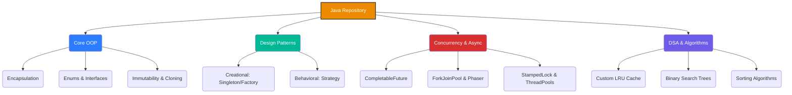

<div align="center">
  <h1>☕ Java Practice & Interview Solutions</h1>
  <p><i>A comprehensive, curated repository of Java concepts, data structures, algorithms, and design patterns.</i></p>
  
  
  
  
  
</div>

<hr />

## 📖 Table of Contents
- [About The Project](#about-the-project)
- [Architecture & Flow](#architecture--flow)
- [Repository Structure](#repository-structure)
  - [Core Java & OOP](#-core-java--oop)
  - [Design Patterns](#-design-patterns)
  - [Concurrency & Advanced APIs](#-concurrency--advanced-apis)
  - [Data Structures & Algorithms](#-data-structures--algorithms)
  - [Application Workflows](#-application-workflows)
- [How to Run](#-how-to-run)
- [Contributing](#-contributing)

---

## 🎯 About The Project

This repository serves as a **knowledge base** and a **practice playground** for Java engineering. It encompasses a wide array of implementations ranging from foundational Object-Oriented Programming (OOP) to advanced asynchronous concurrency and architectural design patterns. It's built for continuous learning and technical interview preparation.

---

## 🏗 Architecture & Flow

Here is a high-level representation of the repository's thematic domains:



---

## 📂 Repository Structure

### 🧠 Core Java & OOP
- **`Encapsulation.java`**: Custom `BankAccount` encapsulation, input validation, and custom exceptions.
- **`immutable.java`**: Immutability principles, final fields, defensive copying, and Builder pattern.
- **`enumDemo.java`**: Java Enums with constructors, custom methods, terminal state logic.
- **`CloningDemo.java`**: Deep Copy vs Shallow Copy comparison using Copy Constructors and `Cloneable`.

### 🧩 Design Patterns
- **`SingletonDemo.java`**: Double-Checked Locking (DCL), Bill Pugh Holder pattern, and Enum Singleton.
- **`DesignPatternsDemo.java`**: Factory Pattern (Notification channels) and Strategy Pattern (Payment processing).
- **`ProducerConsumerDemo.java`**: Multi-threaded Producer-Consumer pattern using `ArrayBlockingQueue`.

### ⚡ Concurrency & Advanced APIs *(New!)*
- **`AdvancedCompletableFutureDemo.java`**: Asynchronous processing pipelines and chaining `CompletableFuture`.
- **`ConcurrentSkipListMapDemo.java`**: Highly scalable concurrent navigation map.
- **`ForkJoinPoolComplexDemo.java`**: Divide-and-conquer parallel computing using `RecursiveTask`.
- **`StampedLockDemo.java`**: Advanced optimistic read locking mechanisms for performance tuning.
- **`PhaserComplexDemo.java`**: Dynamic multi-phase synchronization barriers.
- **`CustomThreadPoolExecutorDemo.java`**: Custom bounds, keep-alive properties, and `CallerRunsPolicy`.
- **`NIO2WatchServiceDemo.java`**: File system monitoring using NIO.2.

### 📐 Data Structures & Algorithms (DSA)
- **`LRUCacheDemo.java`**: Custom generic `LRUCache<K, V>` using HashMap + Doubly Linked List with $O(1)$ operations.
- **`BSTDemo.java`**: Binary Search Tree implementation with node insertion, searching, In-Order, Level-Order (BFS), and DFS.
- **`CustomDataStructuresDemo.java`**: Generic `CustomStack<T>` and `CustomQueue<T>`.
- **`binarySearch.java`**: Iterative and recursive Binary Search with integer overflow prevention.
- **`SortingBenchmarkDemo.java`**: Empirical performance comparison of common sorting algorithms.

### 💼 Application Workflows
- **`supermarket.java`**: Supermarket Billing System with OOP encapsulation and tiered discount logic.
- **`librarySystem.java`**: Library Management System featuring stream-based book search by title/author.

---

## 🚀 How to Run

You can easily compile and run any of the standalone Java files using the standard JDK toolkit.

**1. Clone the repository:**
```bash
git clone https://github.com/psgaikwad2003/java_practice.git
cd java_practice
```

**2. Compile a Java file:**
```bash
javac StreamsDemo.java
```

**3. Run the compiled byte-code:**
```bash
java StreamsDemo
```

---

## 🤝 Contributing

Contributions, issues, and feature requests are welcome! Feel free to check the [issues page](https://github.com/psgaikwad2003/java_practice/issues).

<div align="center">
  <i>Developed with ❤️ for continuous learning in Java Engineering.</i>
</div>
